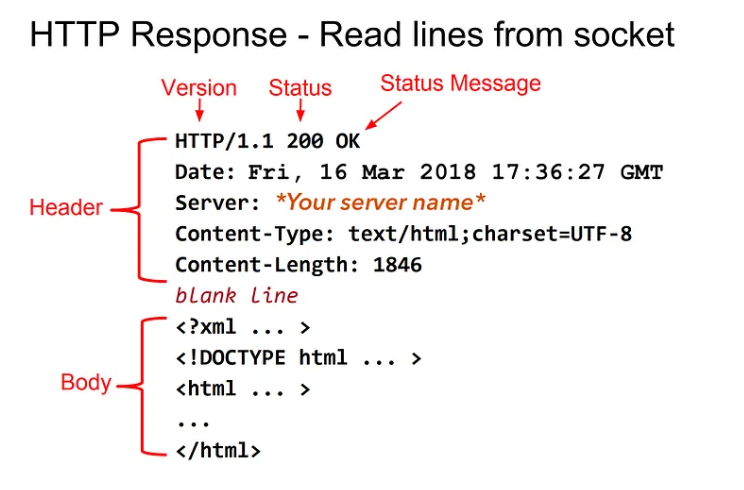

# Background Knowledge

## HTTP

### What is HTTP?

> **H**yperText **T**ransfer **P**rotocol

A standard for communication between computers (two or more participants) using a language that computers can understand, as well as **various control** and **error-handling** methods (behavior conventions and standards).

### What means protocol?

A set of rules that define how computers communicate with each other.

HTTP is a protocol that defines how computers communicate over the internet.

HTTP is a bi-directional protocol, means both the client and the server need to follow the rules.

### What is HyperText?

**Text**: A sequence of characters.

**HyperText**: More than just text. It can contain links to other texts, images, videos, etc.

### Status Codes

* 1xx: Informational
    * Means the request has been received and the process is continuing.
* 2xx: Success
    * Means the action was successfully received, understood, and accepted.
    * 200: OK
    * 201: Created
    * 204: No Content
    * 206: Partial Content
        - The server is delivering only part of the resource due to a range header sent by the client.
* 3xx: Redirection
    * Means resources are not available at the current location and the client should go to another location.
    * 301: Moved Permanently
        * The resource has been moved permanently to a new location.
    * 302: Found
        * The resource has been found at a different location.
    * 304: Not Modified
        * No need to retransmit the resource. The client can use the same cached resource.
* 4xx: Client Error
    * Means the client has done something wrong. The server cannot process the request.
    * 400: Bad Request
        * The server cannot process the request due to a client error.
    * 401: Unauthorized
        * The client must authenticate itself to get the requested response.
    * 403: Forbidden
        * The client does not have permission to access the requested resource.
    * 404: Not Found
        * The server cannot find the requested resource.
    * 405: Method Not Allowed
        * The method specified in the request is not allowed.
    * 408: Request Timeout
        * The server timed out waiting for the request.
    * 429: Too Many Requests
        * The client has sent too many requests in a given amount of time.
* 5xx: Server Error
    * Means the server has done something wrong. The server cannot process the request.
    * 500: Internal Server Error
        * The server has encountered a situation it doesn't know how to handle.
    * 501: Not Implemented
        * The request method is not supported by the server.
    * 502: Bad Gateway
        * The server works fine, but the server received an invalid response from an upstream server.
    * 503: Service Unavailable
        * The server is busy and not ready to handle the request.
    * 504: Gateway Timeout
        * The server received an invalid response from an upstream server.

### Definitions

* **Host**
    * The server that hosts the website. It can be a domain name or an IP address.
        * Example: `www.google.com`
```http
Host: www.google.com
```

* **Content-Length**
    * The size of the response body in bytes.
```http
Content-Length: 1024
```

* **Content-Type**
    * The type of the response body.
        * Example: `text/html`, `application/json`, `image/png`
```http
Content-Type: text/html; Charset=utf-8
Accept: */*
```

* **Connection**
    * Use to manage the connection between the client and the server.
    * `keep-alive`
        * The connection will be kept alive. The client can send multiple requests.
        * The connectio will be closed after a close request, or the server closes the connection. Otherwise, the connection will be kept alive and can be reused.
    * `close`: The connection will be closed after the response.
```http
Connection: keep-alive
```

* **content-encoding**
    * The encoding of the response body.
        * Example: `gzip`, `deflate`
```http
// Client can accept gzip encoding
Accept-Encoding: gzip, deflate

// Server can choose to send the response in gzip encoding
Content-Encoding: gzip
```
### How HTTP response


If we want to send Hello from server, first we need to construct the Header. Then insert a blank line, then we can send our message/data.

The headers shown above are just an example. In fact there are many Headers present in HTTP. You can take a look at the HTTP RFCs → RFC 7230, RFC 7231, RFC 7232, RFC 7233, RFC 7234, RFC 7235.

Now, we will construct a minimal HTTP Header to make our server work.
```c++
char *hello = "HTTP/1.1 200 OK\nContent-Type: text/plain\nContent-Length: 12\n\nHello world!";
```
These 3 Headers are minimum required.

1. `HTTP/1.1 200 OK` → This mentions what version of HTTP we are using, Status code and Status message.
2. `Content-Type: text/plain` → This says that I’m (server) sending a plain text. There are many Content-Types. For example, for images we use this.
3. `Content-Length: 12` → It mentions how many bytes the server is sending to the client. The web-browser only reads how much we mention here.

The next part is the `Body` part. Here, we send our data.

First we need to calculate how many bytes we are sending in Body. Then we mention that in Content-Length. Also, we set the Content-Type appropriately according to the data we are sending.

### Status Code and Status Messages:
Status codes are issued by a server in response to a client’s request made to the server. It includes codes from IETF Request for Comments (RFCs), other specifications, and some additional codes used in some common applications of the Hypertext Transfer Protocol (HTTP).

The first digit of the status code specifies one of five standard classes of responses. The message phrases shown are typical, but any human-readable alternative may be provided. Unless otherwise stated, the status code is part of the HTTP/1.1 standard (RFC 7231).

So, if we can’t find the file that client is asking, then we send appropriate status code.

If the client has no permission to see the file, then we send appropriate status code.

Now, run the below code in the Terminal and go to `localhost:8080` in our browser.

## How do we send a requested web page to the client?

Suppose, we have entered localhost:8080/info.html in the address bar.

In the server Terminal we get the following Request Headers:
```c++
GET /info.html HTTP/1.1
Host: localhost:8080
Connection: keep-alive
Cache-Control: max-age=0
Upgrade-Insecure-Requests: 1
User-Agent: Mozilla/5.0 (Macintosh; Intel Mac OS X 10_13_3) AppleWebKit/537.36 (KHTML, like Gecko) Chrome/65.0.3325.162 Safari/537.36
Accept: text/html,application/xhtml+xml,application/xml;q=0.9,image/webp,image/apng,*/*;q=0.8
DNT: 1
Accept-Encoding: gzip, deflate, br
Accept-Language: en-US,en;q=0.9
```

We only consider the **1st line** in the Request Headers.
```c++
GET /info.html HTTP/1.1
So, we just have to search for the info.html file in current directory(as / specifies that it is looking in the root directory of the server. If it is like /messages/info.html then we have to look inside messages folder for info.html file).
```

There are many cases here to consider:

Some of them are:

1. The file(web page) is present
2. The file(web page) is absent
3. The client doesn’t have permissions to access the file (web page).

And many more…..

If the file is present and the client has permissions to access it, then select appropriate Content-Type from status code.

Then open the file, read the data into a variable. Count the number of bytes read from the file. When you read a simple text file, we can count while reading the file or from the return value of the read() function or `strlen(variable)`. Set the `Content-Length`.

Then construct the **Response Header**.

Now add a `newline` at the end of Response Header and append the data to it which we have read from the file (If and only if the file is present and the client has permissions to access it).

SEND THE RESPONSE HEADER TO THE CLIENT!

That should be a basic for HTTP **SERVER** from scratch.