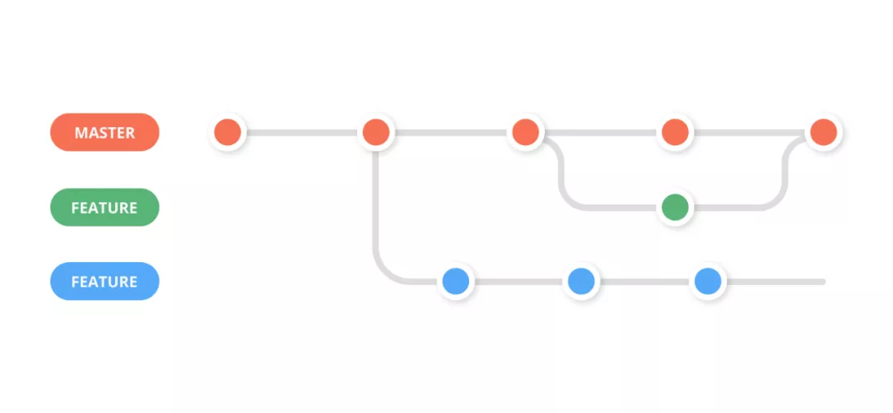

# Colaberate Policy

## Git Workflow

We choose `Feature Branching Git Workflow` as our cowork flow in the project.



#### Step 0.

Checkout to main branch to pull the latest update.

```
> git checkout main
> git pull
```

#### Step 1.

Create new feature branch for each feature, the feature develop life cycle should be around hours work.

```
> git checkout -b feat-<NAME>
```

#### Step 2.

After your work, checkout back to the main branch and align with the latest version again. Then checkout to feature branch and rebase with main branch.

```
> git checkout main
> git pull

> git checkout feat-<NAME>
> git rebase main
```

#### Step 2.a

No confiliction happend! Go to the Step 3.

#### Step 2.b

Occur confiliction when rebase...

1. First, git will pause the rebase and allow you to fix the conflict. You can see which files contain conflicts by running git status.

2. Open the file with conflicts. Git marks conflicts in the source code with <<<<<<<, =======, and >>>>>>>. The code between <<<<<<< and ======= is your local changes and the code between ======= and >>>>>>> is the incoming changes. You need to manually edit the file to resolve the conflict.

3. After you've resolved the conflict, you need to add the resolved files to the staging area and continue the rebase process.

```
> git add <filename>
> git rebase --continue
```

#### Step 3

Push the feature branch to the remote repository branch
PS: Because we use `rebase` to change the history, so it's necessary force push.

```
> git push origin feat-<NAME> --force
```

#### Step 4

Make a pull request and wait for the review and merge by your pear.

## Commit Message Format

```
<type>: <verb.> <description>
```

1. **Type**: What type of change is this?
    * feat: A new feature
    * fix: A bug fix
    * docs: Documentation only changes
    * style: Changes that do not affect the meaning of the code (white-space, formatting, missing semi-colons, etc)
    * refactor: A code change that neither fixes a bug nor adds a feature
    * perf: A code change that improves performance
    * test: Adding missing or correcting existing tests
    * chore: Changes to the build process or auxiliary tools and libraries such as documentation generation
2. **Verb** + **Description** : What does the commit do?
    * add: Add a new feature
    * remove: Remove a feature
    * update: Update an existing feature
    * fix: Fix a bug
    * refactor: Refactor code
    * improve: Improve code
    * test: Add or update tests
    * chore: Update build process

## Branch


### Naming

```
feat-<NAME or ISSUE_NUMBER>
fix-<ISSUE_NUMBER>
```

### Lifetime

* The feature branch should be short-lived. Try to keep the branch small and focused on a single task. (Can not be more than 1 day)
* It should be created when you start working on a feature and deleted after the feature is merged into the main branch.

## Pull Request

```
[<TYPE>] <DESCRIPTION>
```

## Code Review

1. **Code Style**: Follow the code style guide, we choose `Google Style` as our code style.
2. **4-Eyes Principle**: Every code change should be reviewed by at least one other developer.
3. The pull request should be approved by at least one other developer before merging. And the reviewer should understand the code.
4. Need to be compilable and no leak no segfault.

