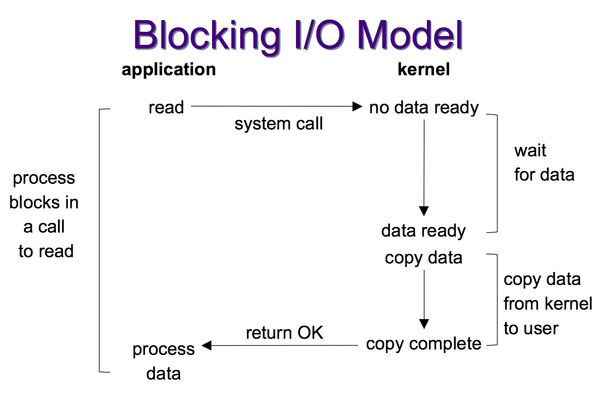
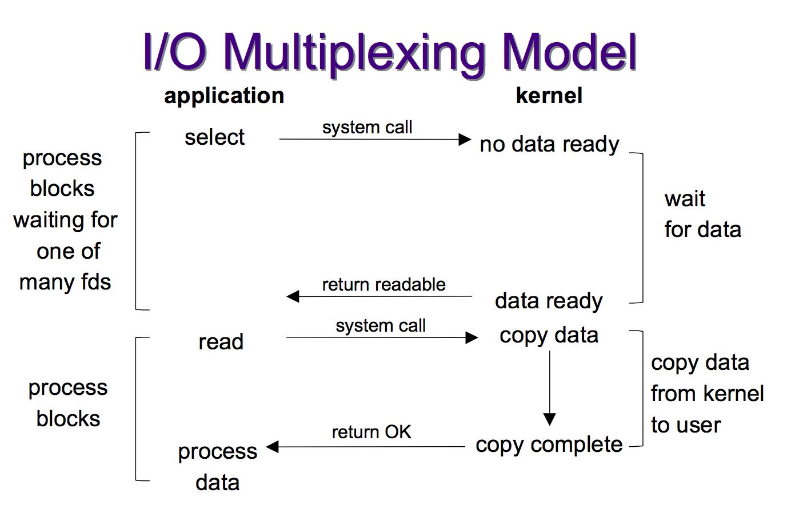
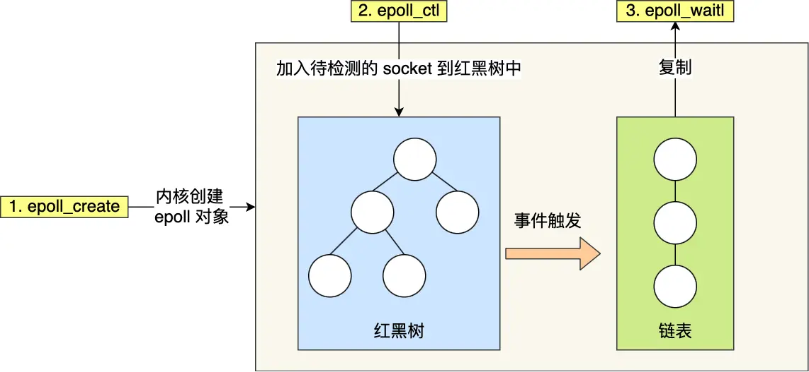

# Non-blocking and blocking IO

## Socket programming

### Why we need to bind a socket to a `port`?

When the kernal recived the TCP packet, it needs to know which application should receive the packet. The `port` is used to identify the application.

### Why we need to bind a socket to an `address`?

In a machine, there can be multiple network interfaces. The `address` is used to identify the network interface.

Only if the `address` be bound to the socket, the socket can receive the packet from the kernal.

### How to check the socket is listening?

```bash
# Use netstat to check the status of the port 8080
netstat -an | grep 8080
```

### How `accept` function works?

When the TCP is connecting, the server side kernel will manage 2 queues:
- TCP half-open queue
    * The queue is not finished the 3-way handshake.
    * The server will be the `SYN-RECV` state.
- TCP full-open queue
    * The queue is finished the 3-way handshake.
    * The server will be the `ESTABLISHED` state.

When the TCP full queue is not empty, the server will use the `accept` function to get the connected socket from the queue and accept the connection.

> [!IMPORTANT]
> The listening socket is not the connected socket. The listening socket is used to listen to the port, and the connected socket is used to communicate with the client.

## How Blocking IO works?

When the server is listening to a port, we can use the `accept` function to accept the connection. The `accept` function will block the server until a client connects to the server.

During the blocking time, the server can't do anything else.




## How to service more clients?

### How many clients can be serviced by the server at the same time?

TCP is based on,
- Server IP (fixed = 1 for each server)
- Server Port (fixed = 1 for each server listening port)
- Client IP
- Client Port

So theroetically,
    - Max clients = number of client IP * number of client Port
        - = 2^32 * 2^16 = 2^48

But in practice, the server can't service so many clients at the same time.
It's because the server has limited resources,
    - Memory
    - File descriptors (default is 1024)

### By using the `fork` function

After the server `accept` the connection, it can use the `fork` function to create a new process to service the client.

#### Cons

- The `fork` function is expensive. It will copy the parent process's memory to the child process.
- At beginning, the memory will be copy-on-write so the memory will not be copied. But the page table will still be copied.
- The context switch between the connection is expensive. And also the scheduler need to manage all the processes.
- For each process will need extra resources to manage the process.

### By using the `thread` function

Straghtforward, the thread is lighter than the process. All the threads share part of the resources, like memory, file descriptors, code segment, gloabl variables, etc.

But create and destroy a thread is still expensive. So we can to use the `thread pool` to manage the threads.

The queue is used to store the tasks. The threads will get the task from the queue and execute the task.

#### Cons

- The queue of the `thread pool` is global. So the threads need to use the lock to protect the queue.
- The lock is expensive. The lock will block the thread until the lock is released.
- The new task will be blocked if the queue is full. And the `thread pool` is not infinite. So the server can't service so many clients at the same time. (e.g. 10k clients is not possible)


### By using the `I/O Multiplexing`

**How to use 1 process/thread to service multiple sockets?**

The `I/O Multiplexing` is used to manage the file descriptors. The server can use the `select`, `poll`, `epoll` to manage the file descriptors.

The concept is if one request is only need 1ms to process then 1 process can service 1000 requests per second. It's same as 1 CPU can support 1000 process.

#### select

##### How `select` works?

1. Add all connected sockets to the `fd_set` set.
2. Use the `select` function to copy the `fd_set` to the kernel.
3. The kernal will iterate all the file descriptors in the `fd_set` and check if the file descriptor is ready to read/write. (time complexity is O(n))
    - After the `select()` mark the file descriptor is ready, the server can use the `read`/`write` function to read/write the data.
4. The kernel will copy the `fd_set` back to the server.
5. The server will iterate all the file descriptors in the `fd_set` and find the file descriptor is marked as ready. (time complexity is O(n))

##### Cons

- The `select` function is not scalable it uses the BitMap to store the file descriptors. So the `select` function can only support 1024 file descriptors no matter how many file descriptors are ready.
- The `select` function is not efficient.
    - The time complexity is O(n) to iterate all the file descriptors both by the kernel and the server.
    - The copy of the `fd_set` also happend 2 times between the server and the kernel.




#### poll

`poll` is similar to the `select` function. But the `poll` function uses the linked list to store the file descriptors. So the `poll` function can support more file descriptors than the `select` function.

##### Cons

- `poll` has the same cons as the `select` function.
    - The time complexity is still O(n) and the copy of the `pollfd` is still 2 times.
    - When the client grows, the time complexity will grow exponentially.

#### epoll

`epoll` is the most efficient way to manage the file descriptors.

##### How `epoll` works?

1. Use the `epoll_create` function to create the `epoll` object.
2. Use the `epoll_ctl` function to add the file descriptors to the `epoll` object.
    - The `epoll_ctl` function will add the file descriptors to the `Red-Black Tree`.
3. Use the `epoll_wait` function to get the ready file descriptors.
    - The `epoll_wait` function will block the server until the file descriptors are ready.
    - The `epoll_wait` function will return the ready file descriptors.

##### Pros

1. The `epoll` function is scalable. It uses the `Red-Black Tree` to store the file descriptors. So the time complexity is O(log n).
2. It uses the event-driven model. The server will only get the ready file descriptors. So the server doesn't need to iterate all the file descriptors.
    - The kernal manages a linked list to store the ready file descriptors.
    - When a socket is ready, the kernal will add the file descriptor to the linked list.
3. It can support the `edge-triggered` and `level-triggered` mode.



**What is the difference between the `edge-triggered` and `level-triggered` mode?**

Use mailbox as an example,
- `edge-triggered` mode
    - When the new message is added to the mailbox, the server will get the message **only once**.
- `level-triggered` mode
    - When the new message is added to the mailbox, before the server gets the message, the mailbox will send the message to the server **continuously**.

Use the `epoll` as an example,
- `edge-triggered` mode
    - When the listening socket is ready, the server will awake from the `epoll_wait` function **only once**.
- `level-triggered` mode
    - When the listening socket is ready, the server will awake from the `epoll_wait` function **continuously** until the server reads all the data from the socket.

In web server, we usually use the `edge-triggered` mode because the `level-triggered` mode will cause the server to busy loop.
And if we want the server won't be blocked, we can use the `non-blocking` mode with the `edge-triggered` mode.


# References

- [Fast Web Server](https://hackmd.io/@sysprog/fast-web-server)
- [selete/poll/epoll](https://www.xiaolincoding.com/os/8_network_system/selete_poll_epoll.html)