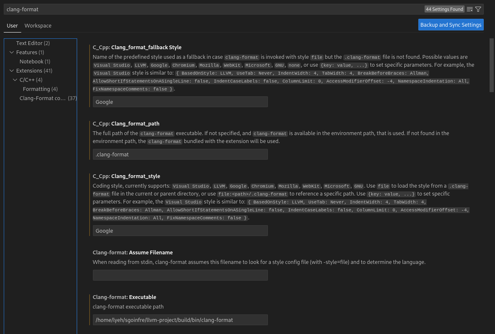

# Setup Coding Style Linter

## Install Clang-Format

```bash
> sudo apt-get install clang-format
```

```bash
# without sudo permission
cd sgoinfre
git clone https://github.com/llvm/llvm-project.git

cd llvm-project
mkdir build
cd build
cmake -G "Unix Makefiles" -DCMAKE_BUILD_TYPE=Release -DLLVM_ENABLE_PROJECTS="clang" ../llvm
make clang-format

# Add the path to the clang-format binary to your PATH
echo 'export PATH=$PATH:/path/to/llvm-project/build/bin' >> ~/.zshrc
```

## Install vscode extension

1. Open Visual Studio Code

2. Press `Ctrl+P` to open the Quick Open dialog

3. Paste the following command and press Enter

```bash
ext install xaver.clang-format
```

4. Press `Ctrl+Shift+P` to open the Command Palette

5. Type `Preferences: Open Settings (UI)` and press Enter



## Config vscode settings

```
{
    "[cpp]": {
        "editor.formatOnSave": true
    },
    "clang-format.executable": "${env.HOME}/sgoinfre/llvm-project/build/bin/clang-format"
}
```

## Config clang-format

```
# .clang-format
BasedOnStyle: Google
Language: Cpp
IndentWidth: 4
```
