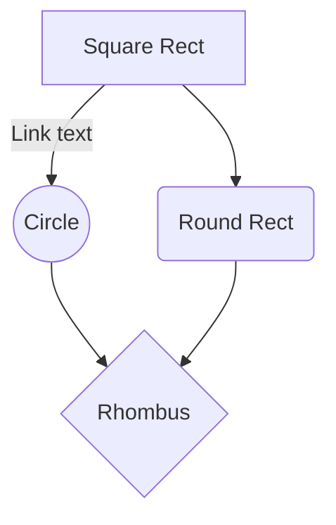
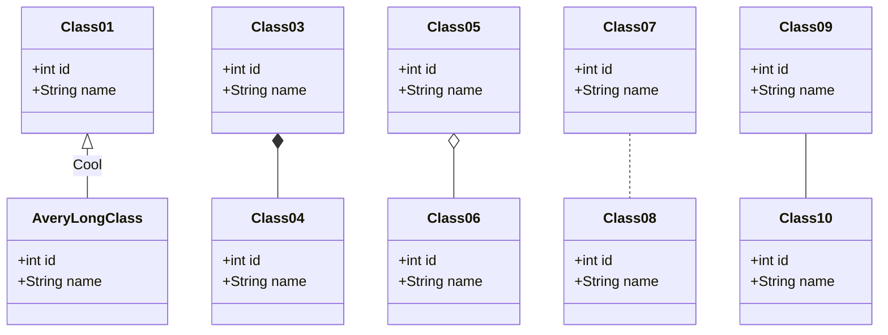

```mermaid
graph TD
    A[Square Rect] -- Link text --> B((Circle))
    A --> C(Round Rect)
    B --> D{Rhombus}
    C --> D
```

```mermaid
classDiagram

Class01 <|-- AveryLongClass : Cool
Class03 *-- Class04
Class05 o-- Class06
Class07 .. Class08
Class09 -- Class10

class Class01 {
    +int id
    +String name
}
class AveryLongClass {
    +int id
    +String name
}
class Class03 {
    +int id
    +String name
}
class Class04 {
    +int id
    +String name
}
class Class05 {
    +int id
    +String name
}
class Class06 {
    +int id
    +String name
}
class Class07 {
    +int id
    +String name
}
class Class08 {
    +int id
    +String name
}
class Class09 {
    +int id
    +String name
}
class Class10 {
    +int id
    +String name
}
```