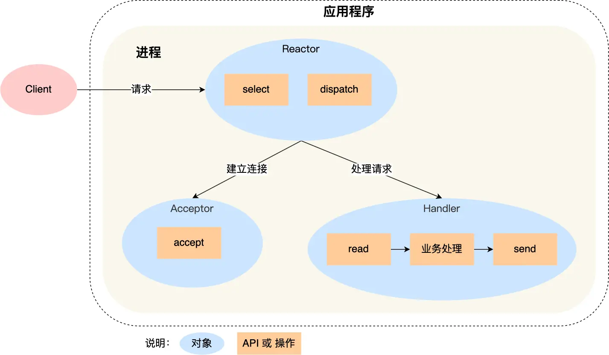
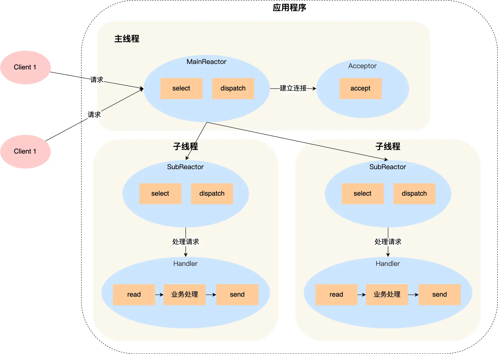

# Web Server Kernel Design

## Simple Flow

Here is a simple flow of a web server:

* Step 1. Recieve a URL request from a client.
* Step 2. Parse the URL to get the file path.
* Step 3. Send the file content to the client.

## Design Pattern for Web Server Kernel

### Reactor Pattern

* Reactor has 4 combinations:
    - single reactor single worker
    - single reactor multiple worker
    - multiple reactor single worker
    - multiple reactor multiple worker

#### Single Reactor Single Worker

* **Reactor**: The reactor is responsible for listening and dispatching the events.
* **Acceptor**: The acceptor is responsible for accepting the new connection.
* **Handler**: The handler is responsible for handling the events.

1. **Reactor** uses the `epoll` function to listen to the events. When the event is ready, the reactor will dispatch the event to the handler.
    - If the event is a *new connection*, the reactor will dispatch the event to the **acceptor**.
    - If the event is a *read or write event*, the reactor will dispatch the event to the **handler**.
2. **Acceptor** will accept the new connection and add the new connection to the `epoll` object.
3. **Handler** will handle the read and write events.

##### Pros

* The single reactor single worker is simple and easy to implement.

##### Cons

* The single reactor single worker is not scalable. The server can only use 1 CPU to handle the events.
* When the **Handler** is blocked, the **acceptor** will be blocked too.

> [!NOTE]
> Redis <= v6.0 uses the single reactor single worker pattern.

#### Single Reactor Multiple Workers

First 3 steps are the same as the single reactor single worker.

1. **Reactor** uses the `epoll` function to listen to the events. When the event is ready, the reactor will dispatch the event to the handler.
    - If the event is a *new connection*, the reactor will dispatch the event to the **acceptor**.
    - If the event is a *read or write event*, the reactor will dispatch the event to the **handler**.
2. **Acceptor** will accept the new connection and add the new connection to the `epoll` object.
3. **Handler** will handle the events which is not about the new connection.

Now the difference is the **Handler**,

- **Handler** won't handle how to response to the client. Instead, the **Handler** will focus on the data recieves and send. When the **Handler** recieves the data, the **Handler** will dispatch the event to the **Processor**.
- **Processor** will process the data and send the response to the **Handler**. The **Handler** will send the response to the client.

##### Pros

* The single reactor multiple worker is scalable. The server can use multiple CPUs to handle the events.
* The **Handler** won't be blocked. The **acceptor** can accept the new connection.

##### Cons

* Multiple thread/process will occur share data racing, when the **Processor** sends the response to the **Handler** it need to lock the data to avoid the disorder.
* For the **Single Reactor** pattern, the only one **Reactor** need to handle all the listening events. When it occurs a lot of events at the same time, the **Reactor** will be the bottleneck of the server performance.

#### Multiple Reactor Multiple Workers

1. **Main Reactor** uses the `epoll` function to listen to the events. When the event is ready, the **Main Reactor** will dispatch the event to the **Sub Reactor**.
    - If the event is a *new connection*, the **Main Reactor** will dispatch the event to the **acceptor**.
    - If the event is a *read or write event*, the **Main Reactor** will dispatch the event to the **Sub Reactor**.
2. **Sub Reactor** will use the `epoll` function to listen to the events. When the event is ready, the **Sub Reactor** will dispatch the event to the **Handler**.
    * When the new event is ready, the corresponding **Handler** of the **Sub Reactor** will handle the event.

##### Pros

* Easier to implement than the **Single Reactor Multiple Worker**.
    * The main process and the sub process are independent. So the data racing won't occur.
    * main process only need to dispatch and accept the new connection. The sub process will handle the events.
    * The sub process do not need to send the response to the main process. The sub process will send the response to the client directly. No extra communication between the main process and the sub process.

* The **Main Reactor** will dispatch the events to the **Sub Reactor**. So the **Main Reactor** won't be the bottleneck of the server performance.

> [!NOTE]
> Nginx uses the multiple reactor multiple process pattern.

> [!NOTE]
> Netty and Memcache uses the multiple reactor multiple theards pattern.

### Proactor Pattern

Compare to the Reactor Pattern, the Proactor Pattern is more complex. It's a asynchronous IO pattern.

* **Reactor** is a synchronous non-blocking IO pattern.
* **Proactor** is a asynchronous IO pattern.

The **Proactor** has more efficient than the **Reactor**. But in Linux, the **Proactor** is not well supported Async IO. The **Proactor** is supported in Windows.

# References

- [Reactor and Proactor](https://www.xiaolincoding.com/os/8_network_system/reactor.html)