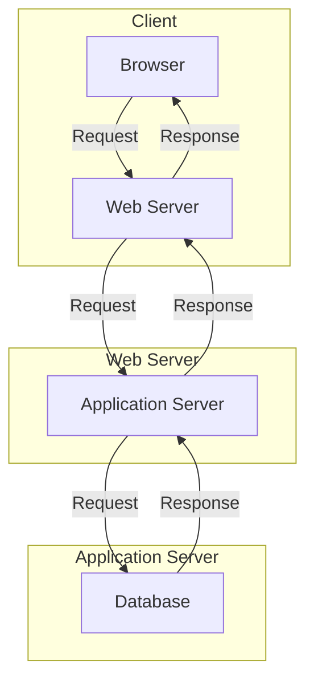

# Web Server Architecture

```mermaid

graph TD
    subgraph "Client"
        A[Browser] -->|Request| B[Web Server]
        B -->|Response| A
    end
    subgraph "Web Server"
        B -->|Request| C[Application Server]
        C -->|Response| B
    end
    subgraph "Application Server"
        C -->|Request| D[Database]
        D -->|Response| C
    end
```